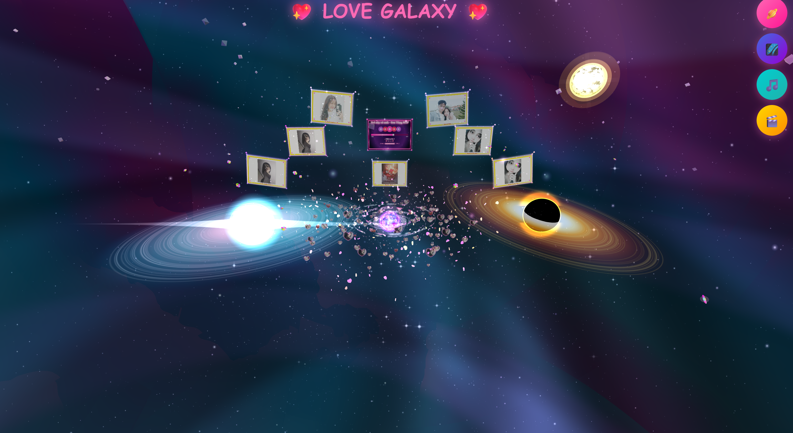

# 🌌 Love Galaxy - Thiên Hà Tình Yêu 💖

  

A high-performance, aesthetically stunning web project that creates an immersive "Love Galaxy" experience using advanced HTML5 Canvas and mathematical logic.

## ✨ Highlights
- **Mathematical Complexity**: Built with over **6,000 lines of pure JavaScript**, featuring complex particle systems, orbital physics, and mathematical animations.
- **Audio-Visual Integration**: Seamlessly synchronizes visual effects with atmospheric background music ("Nơi Này Có Anh") to create a romantic digital universe.
- **Performance Optimized**: High-frame-rate rendering of thousands of particles using optimized Canvas API techniques.
- **Pure Vanilla**: Zero external frameworks. Demonstrates deep mastery of core web technologies and performance-critical logic.

## 🛠 Tech Stack
- **Frontend**: HTML5, CSS3, Vanilla JavaScript (ES6+)
- **Graphics**: HTML5 Canvas API
- **Logic**: Custom Particle Engine, Mathematical Coordinate Systems

## 📂 Project Structure
- `thienhatinhyeu.html`: Main application entry point.
- `thienhatinhyeu.js`: The "brain" of the galaxy, containing 6000+ lines of animation and logic.
- `Nơi Này Có Anh.mp3`: Thematic background audio.

---
*A project that blends technical rigor with creative artistry.*

**Designed by Pham Van Minh - Hanoi University of Science and Technology.**
